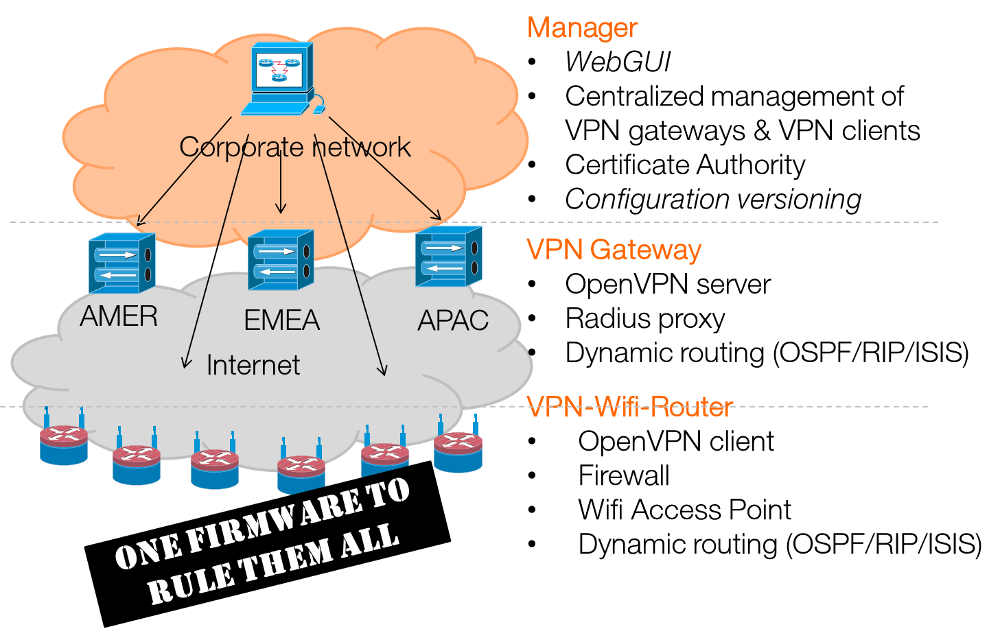

Easy Internet vpN Extender (EINE)
=================================

EINE is a solution for large-scale plug&play x86 network appliance deployment over Internet

License: BSD 2-clause
Author: [Orange Business Services] (http://www.orange-business.com) 

EINE, a sub-project of BSD Router Project,  permit to generate an x86 raw image disk (appliance firmware) to be use for deploying this solution:



The demo EINE firmware include build-in DEMO certificate and passwords that NEED to be customized for your usage.
Private AND public keys/certificates are embedded in the demo firmware, then are totally unsecure.

For building your own EINE firmware, you NEED:
  - A FreeBSD Operating system (10.1 minimum)
  - with an Internet access for downloading sources

Then you had to follow these steps:

1. Download source
```
svnlite co https://github.com/ocochard/BSDRP/trunk BSDRP
cd BSDRP
```
1. Create EINE/local.data directory
```
mkdir EINE/local.data
```
2. Edit EINE/local.data/data.conf for customize your:
    - admin username
    - Root password
    - check example in EINE/DEMO.data/data.conf
3. Create private and public SSH key pairs in EINE/local.data (id_ed25519 and id_ed25519.pub)
4. Generate easy-rsa configuration file and put it in EINE/local.data/easy-rsa.vars
5. Genarate a CA certificate and put then into EINE/local.data/keys
6. Download GeoIP2 database
```
cd EINE/local.data
fetch http://geolite.maxmind.com/download/geoip/database/GeoLite2-City.mmdb.gz
gunzip GeoLite2-City.mmdb.gz
```
7. Generate EINE x86 disk image using BSD Router Project build script
```
cd ../..
./make.sh -p EINE
```
